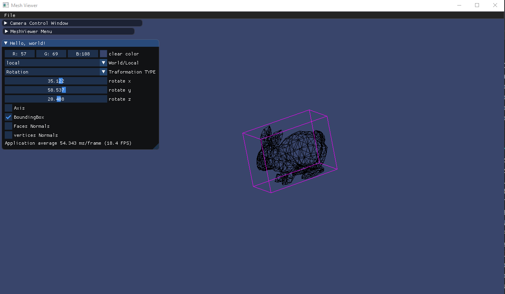
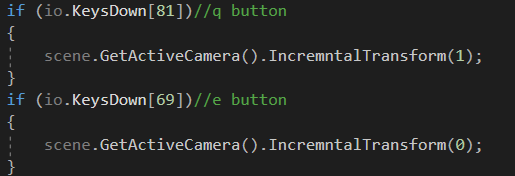

# Assignement 1_c
 Student1 : Wajeeh Atrash - 322773946	
 
Student2 :Mohammed Seh - 209332212
___
## 1.Implementing a camera with orthographic projection 
we romved the centering trick from the last assignement, and to let the model appear at the middle of the scene we mapped the mesh model point that we get after doing the transformation from the canonical view volume using the following steps:
for each x=(x+1)*width/2
for each y=(y+1)*height/2
Camera parametrs :
 - Left =-100
 - Right =100
 - Top= 1000
 - Bottom = -100

_____
Camera parametrs :
 - Left =-36.406
 - Right =56.682
 - Top= 100
 - Bottom = -100

## 2.Window Resizing

## 3.Drawing the Axis 

## 4.Comparing between T1 and T2
**T1**

 - Translate x 10000
 - translate y -10000
 - Rotate x 270
 - Rotate y 190
 - Rotate z 120
 
 **T2**
 
 - Translate x -5000
 - translate y 5000
 - Rotate x 120
 - Rotate y 190
 - Rotate z 200
 
**T1-Model  T2-world** 

**T1-World T2-Model**

## 5.BoundingBox FaceNormal Vertex Normal
we found the max and min values for each axes in the loaded mesh model vertices list then made 8 (box vertices) then we multiplied them by the camera transform and the model transform  then we used the DrawLine method to connect the 8 points and make the boundingBox

**BoundingBox**

___
for each Face we calculated the normal using the dormula we learned at the class then we scaled the normal up to see it probably at the screen after that w ecalculated the center of the face and from this point we Draw a line in the normal direction 

**Faces Normals**

for the vertex normals we used the calculated normals at the obj file for the loaded mesh, we scaled them then draw  them

**Vertex Normal**

**Gif**

## 6.Difference Between perspective projection and orthographic projection
perspective view we can notice at the gif that if we make the camera move closer the objects get bigger, and if we make it move away the objects look smaller, on the other hand the distance of the camera in the orthographic  view doesn't change the object size

## 7.showing the differnce between changing the size of the frustum and moving farther from the model

## 8.Rotating the Camera around the y axis

## 9.Seting the camera position to(10,10,10)

## 10. incremental transformation
we implement an incremental transformation using the q and e buttons to make an incrematal translation at the x axis 

## 11.Multiples Modelsand Cameras on the screen
**View from Cam1**

**View from Cam2**

## 12. GUI screenshots

