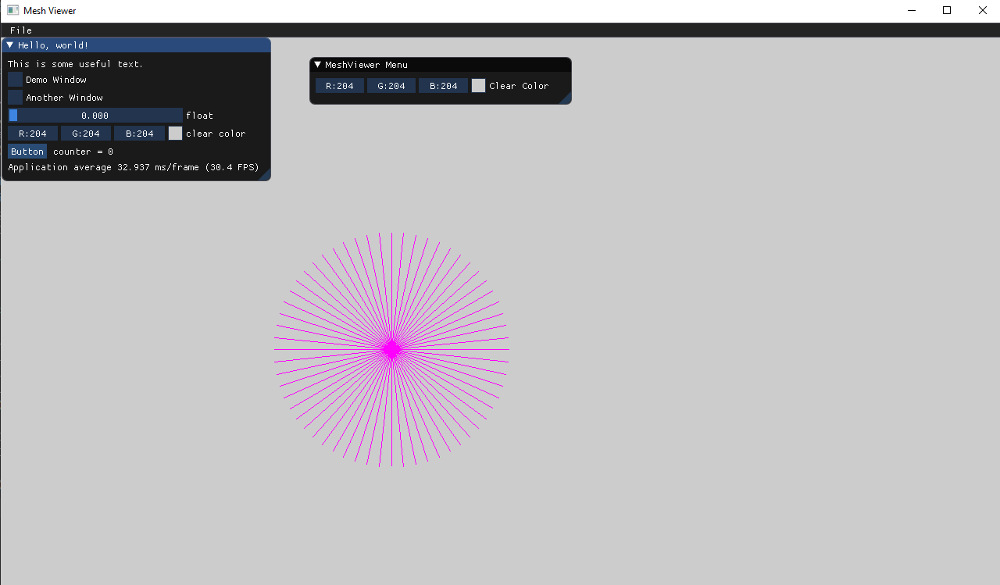

# Assignment 1.a Report 
# our code

    //SWITCH AND REFLECT FLAG
	bool switch_flag = false, reflect_flag = false;
	//-------------------------------------
	int x1 = p1.x, x2 = p2.x, y1 = p1.y, y2 = p2.y;
	if (x1 == x2)//straight line case 
	{
		while (y1 != y2)
		{
			PutPixel(x1, y1, color);
			if (y1 > y2)
			{
				y1 -= 1;
			}
			else
			{
				y1 += 1;
			}
		}
		return;
	}
	if (x1 > x2)//we need to swap the cordinates of the starting pint and the ending point of the line
	{
		//swaping the x coordinates
		int temp = x1;
		x1 = x2;
		x2 = temp;
		//------------------------
		//swaping the y coordinates
		temp = y1;
		y1 = y2;
		y2 = temp;
	}
	float dy = y2 - y1, dx = x2 - x1;
	float slope = dy / dx;
	int e = -dx;
	if (slope > 1) {
		switch_flag = true;
		e = -dy;
	}
	if (0 > slope&&slope >= -1) {
		reflect_flag = true;
		e = -dx;
	}
	if (slope < -1)
	{
		reflect_flag = true;
		switch_flag = true;
		e = dy;
	}
	int x = x1, y = y1, goal = x2;
	if (switch_flag)
	{
		while (y <= y2 && !reflect_flag || reflect_flag && y >= y2)
		{
			if (e > 0)
			{
				if (reflect_flag) {//m<-1
					x = x + 1;
					e = e + 2 * dy;
				}
				else if (reflect_flag == false)//m>1
				{
					x = x + 1;
					e = e - 2 * dy;
				}
			}
			PutPixel(x, y, color);
			if (reflect_flag) {//m<-1
				y = y - 1;
				e = e + 2 * dx;
			}
			else//m>1
			{
				y = y + 1;
				e = e + 2 * dx;
			}
		}
	}
	else
	{
		while (x <= x2)
		{
			if (e > 0)
			{
				if (reflect_flag) {//-1<m<0
					y = y - 1;
					e = e - 2 * dx;
				}
				else//0<m<1
				{
					y = y + 1;
					e = e - 2 * dx;
				}
			}
			PutPixel(x, y, color);
			if (reflect_flag) {//-1<m<0
				x = x + 1;
				e = e - 2 * dy;
			}
			else//0<m<1
			{
				x = x + 1;
				e = e + 2 * dy;
			}
		}
	}
	

# Our Results

 - circle with 360 lines
  
  
 - circle with 60 lines
 
 - our old phone that runs zoom
 
