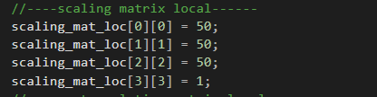
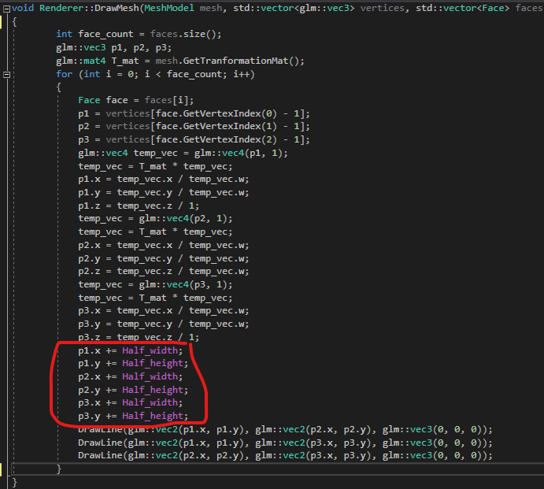
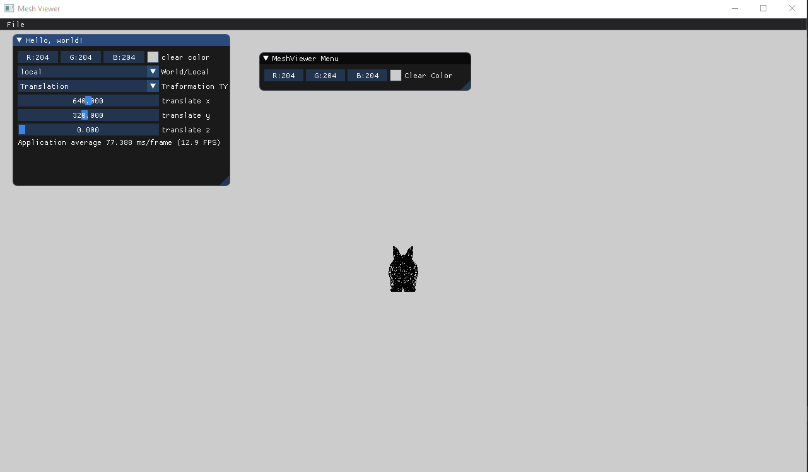
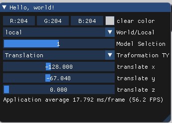
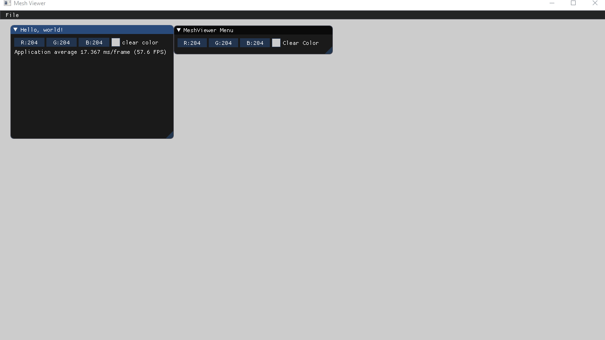
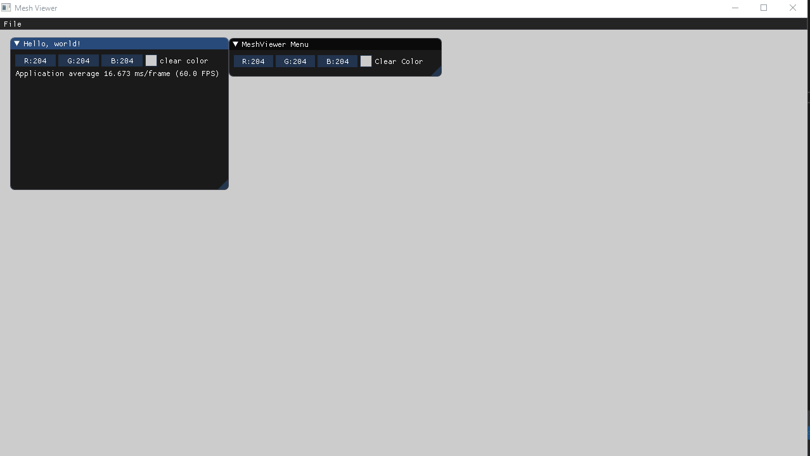
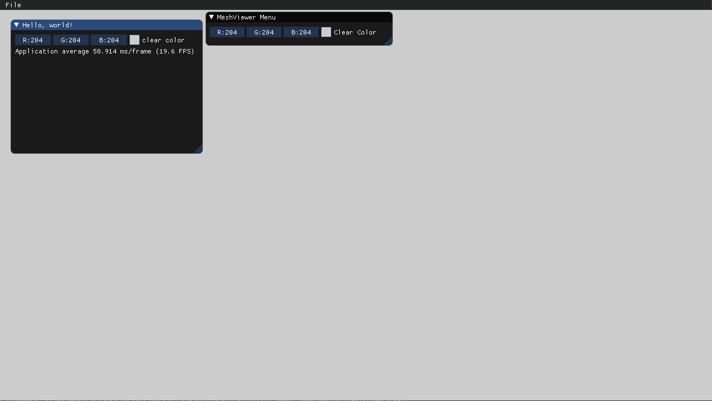
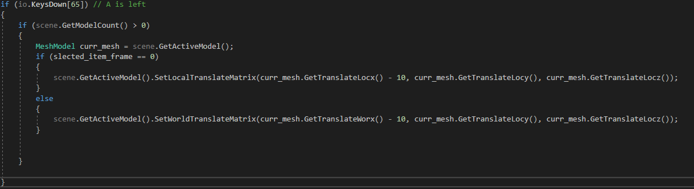

# Assignment1_ Part b
Student 1 :Mohammed Seh - 209332212
student 2 :Wajeeh Atrash - 322773946
## 1.loading a mesh model and printing the vertices and the faces
we printed the vertices and the faces in the utils class in LoadMeshModel function where we have a direct accses to the loaded mesh vertices and faces

     model vertices:
    (0.023600,-0.086540,-0.001530)
    (0.024350,-0.083880,-0.001450)
     (0.025000,-0.083690,-0.001830)
     (0.025560,-0.083880,-0.001860)
     (0.026100,-0.083880,0.000090)
     (0.025960,-0.083880,0.002570)
     (0.025480,-0.083650,0.003400)
     (0.024750,-0.083880,0.003780)
     (0.023800,-0.086400,0.004010)
     (0.022730,-0.089180,0.003780)
     (0.021830,-0.089890,0.003840)
     (0.021120,-0.090000,0.003380)
     (0.020660,-0.089440,0.000430)
     (0.021120,-0.088780,-0.002260)
     (0.021860,-0.089160,-0.002320)
     (0.022730,-0.089180,-0.001860)
     (0.023040,-0.085680,-0.001700)
     (0.023740,-0.083090,-0.001610)
     (0.024430,-0.082920,-0.001920)
     (0.025010,-0.083120,-0.001880)
     (0.025450,-0.083110,0.000100)
     (0.025240,-0.083070,0.002480)
     (0.024830,-0.082850,0.003150)
     (0.024230,-0.083030,0.003470)
     (0.023260,-0.085500,0.003820)
     (0.022140,-0.088290,0.003770)
     (0.021310,-0.088990,0.003860)
     (0.020640,-0.089130,0.003420)
     (0.020090,-0.088600,0.000470)
     (0.020460,-0.087920,-0.002300)
     (0.021260,-0.088300,-0.002410)
     (0.022200,-0.088280,-0.001980)
     (0.021330,-0.082680,-0.002320)
     (0.022020,-0.080290,-0.002160)
     (0.022830,-0.080150,-0.002280)
     (0.023470,-0.080400,-0.002020)
     (0.023680,-0.080320,0.000200)
     (0.023290,-0.080190,0.002380)
     (0.023050,-0.080020,0.002750)
     (0.022680,-0.080100,0.002920)
     (0.021590,-0.082390,0.003520)
     (0.020250,-0.085160,0.003900)
     (0.019550,-0.085870,0.004010)
     (0.019000,-0.086080,0.003590)
     (0.018230,-0.085600,0.000560)
     (0.018400,-0.084900,-0.002490)
     (0.019330,-0.085240,-0.002780)
     (0.020460,-0.085150,-0.002460)
     (0.018440,-0.076910,-0.003520)
     (0.019350,-0.074790,-0.003270)
     (0.020410,-0.074690,-0.003080)
     (0.021170,-0.075030,-0.002380)
     (0.021080,-0.074830,0.000410)
     (0.020460,-0.074570,0.002590)
     (0.020330,-0.074460,0.002680)
     (0.020150,-0.074460,0.002700)
     (0.018690,-0.076500,0.003560)
     (0.016870,-0.079150,0.004360)
     (0.016300,-0.079880,0.004450)
     (0.015900,-0.080190,0.003960)
     (0.014850,-0.079770,0.000620)
     (0.014760,-0.079020,-0.002970)
     (0.015900,-0.079310,-0.003570)
     (0.017340,-0.079140,-0.003440)
     (0.014340,-0.067700,-0.005440)
     (0.015870,-0.065920,-0.005080)
     (0.017360,-0.065890,-0.004490)
     (0.018290,-0.066330,-0.003070)
     (0.018000,-0.065930,0.000730)
     (0.017080,-0.065510,0.003380)
     (0.016920,-0.065460,0.003430)
     (0.016680,-0.065510,0.003380)
     (0.014430,-0.067260,0.004450)
     (0.011830,-0.069590,0.005390)
     (0.011300,-0.070390,0.005330)
     (0.011020,-0.070820,0.004590)
     (0.009690,-0.070420,0.000590)
     (0.009410,-0.069590,-0.003870)
     (0.010760,-0.069810,-0.004950)
     (0.012640,-0.069590,-0.005080)
     (0.008230,-0.055800,-0.008750)
     (0.011330,-0.054380,-0.008180)
     (0.013600,-0.054410,-0.007000)
     (0.014790,-0.054800,-0.004380)
     (0.014710,-0.054330,0.001360)
     (0.013290,-0.053850,0.005800)
     (0.012630,-0.053760,0.006540)
     (0.011510,-0.053960,0.006730)
     (0.007540,-0.055420,0.007690)
     (0.003660,-0.057280,0.007810)
     (0.002810,-0.058090,0.007300)
     (0.002520,-0.058560,0.005870)
     (0.001070,-0.058230,0.000400)
     (0.000990,-0.057440,-0.005570)
     (0.002540,-0.057540,-0.007430)
     (0.005030,-0.057310,-0.007970)
     (0.000720,-0.041510,-0.013200)
     (0.006240,-0.040470,-0.012270)
     (0.009520,-0.040450,-0.010350)
     (0.011080,-0.040670,-0.006230)
     (0.011530,-0.040320,0.002260)
     (0.009580,-0.039970,0.009560)
     (0.007980,-0.039860,0.011820)
     (0.005260,-0.040070,0.012440)
     (-0.001110,-0.041180,0.012790)
     (-0.006750,-0.042520,0.011370)
     (-0.008300,-0.043190,0.010130)
     (-0.008770,-0.043580,0.007670)
     (-0.010130,-0.043400,0.000050)
     (-0.009600,-0.042830,-0.007930)
     (-0.007870,-0.042820,-0.010760)
     (-0.004700,-0.042600,-0.011850)
     (-0.005970,-0.023440,-0.017450)
     (0.001930,-0.022860,-0.016190)
     (0.006130,-0.022780,-0.013580)
     (0.008040,-0.022830,-0.008100)
     (0.009090,-0.022680,0.002930)
     (0.006790,-0.022540,0.012950)
     (0.004270,-0.022460,0.016840)
     (-0.000020,-0.022580,0.017950)
     (-0.008650,-0.023200,0.017610)
     (-0.016050,-0.023950,0.014650)
     (-0.018410,-0.024340,0.012700)
     (-0.019160,-0.024560,0.009230)
     (-0.020360,-0.024530,-0.000430)
     (-0.019170,-0.024260,-0.010280)
     (-0.017260,-0.024200,-0.013970)
     (-0.013530,-0.024040,-0.015570)
     (-0.009620,-0.000200,-0.020190)
     (-0.000290,-0.000200,-0.018770)
     (0.004440,-0.000200,-0.015760)
     (0.006580,-0.000200,-0.009510)
     (0.008100,-0.000200,0.002810)
     (0.005770,-0.000200,0.014260)
     (0.002840,-0.000200,0.019180)
     (-0.002310,-0.000200,0.020700)
     (-0.012270,-0.000200,0.020080)
     (-0.020880,-0.000200,0.016270)
     (-0.023900,-0.000200,0.013900)
     (-0.024920,-0.000200,0.009820)
     (-0.026100,-0.000200,-0.001040)
     (-0.024520,-0.000200,-0.011930)
     (-0.022520,-0.000200,-0.016090)
     (-0.018460,-0.000200,-0.017970)
     (-0.008880,0.023680,-0.020700)
     (0.000520,0.023020,-0.019370)
     (0.005230,0.022730,-0.016420)
     (0.007450,0.022610,-0.010340)
     (0.009230,0.022540,0.001310)
     (0.007400,0.022580,0.012250)
     (0.004940,0.022480,0.017240)
     (0.000140,0.022590,0.019110)
     (-0.009910,0.023310,0.018990)
     (-0.019090,0.024210,0.015540)
     (-0.022530,0.024720,0.013290)
     (-0.023900,0.025050,0.009180)
     (-0.025270,0.025220,-0.001740)
     (-0.023700,0.024990,-0.012580)
     (-0.021750,0.024760,-0.016640)
     (-0.017740,0.024370,-0.018460)
     (-0.004850,0.043280,-0.019430)
     (0.003670,0.042040,-0.018320)
     (0.007960,0.041350,-0.015790)
     (0.010110,0.041020,-0.010600)
     (0.012040,0.040940,-0.001020)
     (0.011050,0.041110,0.008090)
     (0.009610,0.040950,0.012540)
     (0.005930,0.041130,0.014660)
     (-0.003290,0.042470,0.015530)
     (-0.012530,0.044250,0.013250)
     (-0.016240,0.045290,0.011500)
     (-0.017950,0.045990,0.007750)
     (-0.019560,0.046450,-0.002410)
     (-0.018250,0.046040,-0.012390)
     (-0.016480,0.045460,-0.015930)
     (-0.012840,0.044590,-0.017450)
     (0.001030,0.059280,-0.016850)
     (0.008070,0.057690,-0.016000)
     (0.011630,0.056690,-0.014010)
     (0.013540,0.056170,-0.010020)
     (0.015440,0.056070,-0.003050)
     (0.015290,0.056330,0.003690)
     (0.014840,0.056140,0.007280)
     (0.012440,0.056350,0.009410)
     (0.004700,0.058050,0.011110)
     (-0.003890,0.060420,0.010140)
     (-0.007550,0.061840,0.009010)
     (-0.009430,0.062820,0.005840)
     (-0.011150,0.063540,-0.002880)
     (-0.010170,0.063050,-0.011360)
     (-0.008690,0.062200,-0.014180)
     (-0.005610,0.060980,-0.015290)
     (0.007280,0.072410,-0.013420)
     (0.012640,0.070820,-0.012730)
     (0.015240,0.069770,-0.011200)
     (0.016680,0.069180,-0.008300)
     (0.018370,0.069000,-0.003610)
     (0.018700,0.069180,0.000960)
     (0.018660,0.068990,0.003620)
     (0.017080,0.069180,0.005390)
     (0.011160,0.070870,0.007210)
     (0.004160,0.073270,0.007000)
     (0.001010,0.074710,0.006290)
     (-0.000690,0.075710,0.003780)
     (-0.002210,0.076510,-0.003010)
     (-0.001500,0.076120,-0.009510)
     (-0.000310,0.075300,-0.011600)
     (0.002140,0.074080,-0.012330)
     (0.013050,0.081870,-0.009640)
     (0.016750,0.080640,-0.009000)
     (0.018310,0.079840,-0.007770)
     (0.019110,0.079370,-0.005700)
     (0.020460,0.079130,-0.002680)
     (0.020870,0.079180,0.000190)
     (0.020660,0.079000,0.001940)
     (0.019300,0.079160,0.003110)
     (0.015250,0.080440,0.004370)
     (0.010530,0.082260,0.004240)
     (0.008280,0.083370,0.003660)
     (0.007060,0.084130,0.001820)
     (0.006020,0.084770,-0.002780)
     (0.006570,0.084550,-0.007110)
     (0.007500,0.084000,-0.008550)
     (0.009320,0.083120,-0.009000)
     (0.018010,0.087170,-0.006120)
     (0.020230,0.086480,-0.005490)
     (0.020840,0.086030,-0.004480)
     (0.021030,0.085760,-0.003080)
     (0.022000,0.085590,-0.001370)
     (0.022370,0.085580,0.000130)
     (0.021870,0.085460,0.001080)
     (0.020510,0.085570,0.001620)
     (0.018130,0.086300,0.002180)
     (0.015660,0.087310,0.001930)
     (0.014320,0.087930,0.001400)
     (0.013640,0.088350,0.000140)
     (0.013110,0.088710,-0.002410)
     (0.013550,0.088630,-0.004750)
     (0.014240,0.088350,-0.005640)
     (0.015520,0.087860,-0.005880)
     (0.021450,0.089490,-0.003510)
     (0.022640,0.089280,-0.002880)
     (0.022560,0.089140,-0.002020)
     (0.022280,0.089060,-0.001060)
     (0.022910,0.089010,-0.000220)
     (0.023260,0.088990,0.000390)
     (0.022450,0.088930,0.000790)
     (0.021020,0.088990,0.000810)
     (0.019910,0.089230,0.000750)
     (0.019070,0.089510,0.000340)
     (0.018450,0.089710,-0.000210)
     (0.018200,0.089830,-0.001020)
     (0.018090,0.089930,-0.002080)
     (0.018460,0.089920,-0.002970)
     (0.018980,0.089850,-0.003470)
     (0.019880,0.089700,-0.003570)
     (0.022730,0.090000,-0.002480)
     (0.023540,0.090000,-0.001860)
     (0.023190,0.090000,-0.001030)
     (0.022730,0.090000,-0.000250)
     (0.023210,0.090000,0.000260)
     (0.023540,0.090000,0.000560)
     (0.022540,0.090000,0.000770)
     (0.021120,0.090000,0.000560)
     (0.020580,0.090000,0.000240)
     (0.020310,0.090000,-0.000250)
     (0.019980,0.090000,-0.000850)
     (0.019910,0.090000,-0.001450)
     (0.019980,0.090000,-0.001920)
     (0.020310,0.090000,-0.002260)
     (0.020770,0.090000,-0.002590)
     (0.021520,0.090000,-0.002660)
    model faces:
     f:2//1 18//2 3//3
     f:19//4 3//3 18//2
     f:19//4 4//5 3//3
     f:19//4 20//6 4//5
     f:4//7 20//8 5//9
     f:21//10 5//9 20//8
     f:21//10 6//11 5//9
     f:21//10 22//12 6//11
     f:7//13 6//11 22//12
     f:7//13 22//12 23//14
     f:7//15 23//16 8//15
     f:24//17 8//15 23//16
     f:8//18 24//19 9//20
     f:25//21 9//20 24//19
     f:25//21 10//22 9//20
     f:25//21 26//23 10//22
     f:11//24 10//22 26//23
     f:11//24 26//23 27//25
     f:11//26 27//27 12//26
     f:28//27 12//26 27//27
     f:12//28 28//29 13//30
     f:29//31 13//30 28//29
     f:29//31 14//32 13//30
     f:29//31 30//33 14//32
     f:14//34 30//35 15//34
     f:31//35 15//34 30//35
     f:15//36 31//37 16//38
     f:32//39 16//38 31//37
     f:32//39 1//40 16//38
     f:32//39 17//41 1//40
     f:2//42 1//40 17//41
     f:2//42 17//41 18//43
     f:35//44 19//4 34//44
     f:18//2 34//44 19//4
     f:19//6 35//45 20//6
     f:36//46 20//6 35//45
     f:20//8 36//47 21//10
     f:37//48 21//10 36//47
     f:37//48 22//12 21//10
     f:37//48 38//49 22//12
     f:23//14 22//12 38//49
     f:23//14 38//49 39//50
     f:23//16 39//51 24//17
     f:40//52 24//17 39//51
     f:24//19 40//52 25//21
     f:41//53 25//21 40//52
     f:41//53 26//23 25//21
     f:41//53 42//54 26//23
     f:27//25 26//23 42//54
     f:27//25 42//54 43//55
     f:27//27 43//56 28//27
     f:44//56 28//27 43//56
     f:28//29 44//57 29//31
     f:45//58 29//31 44//57
     f:45//58 30//33 29//31
     f:45//58 46//59 30//33
     f:30//35 46//60 31//35
     f:47//60 31//35 46//60
     f:31//37 47//61 32//39
     f:48//62 32//39 47//61
     f:48//62 17//41 32//39
     f:48//62 33//63 17//41
     f:18//43 17//41 33//63
     f:18//43 33//63 34//64
     f:51//65 35//45 50//66
     f:34//44 50//66 35//45
     f:35//45 51//67 36//46
     f:52//68 36//46 51//67
     f:36//47 52//69 37//48
     f:53//70 37//48 52//69
     f:53//70 38//49 37//48
     f:53//70 54//71 38//49
     f:39//50 38//49 54//71
     f:39//50 54//71 55//72
     f:39//51 55//73 40//52
     f:56//74 40//52 55//73
     f:56//74 41//53 40//52
     f:56//74 57//75 41//53
     f:42//54 41//53 57//75
     f:42//54 57//75 58//76
     f:42//54 58//76 43//55
     f:59//77 43//55 58//76
     f:60//78 44//56 59//78
     f:43//56 59//78 44//56
     f:44//57 60//79 45//58
     f:61//80 45//58 60//79
     f:61//80 46//59 45//58
     f:61//80 62//81 46//59
     f:46//60 62//82 47//60
     f:63//82 47//60 62//82
     f:47//61 63//83 48//62
     f:64//84 48//62 63//83
     f:64//84 33//63 48//62
     f:64//84 49//85 33//63
     f:34//64 33//63 49//85
     f:34//64 49//85 50//66
     f:68//86 52//68 67//86
     f:51//67 67//86 52//68
     f:52//69 68//87 53//70
     f:69//88 53//70 68//87
     f:69//88 54//71 53//70
     f:69//88 70//89 54//71
     f:54//90 70//91 55//73
     f:71//92 55//73 70//91
     f:55//73 71//93 56//74
     f:72//94 56//74 71//93
     f:72//94 57//75 56//74
     f:72//94 73//95 57//75
     f:58//76 57//75 73//95
     f:58//76 73//95 74//96
     f:58//76 74//96 59//77
     f:75//97 59//77 74//96
     f:59//78 75//98 60//79
     f:76//99 60//79 75//98
     f:76//99 61//80 60//79
     f:76//99 77//100 61//80
     f:62//81 61//80 77//100
     f:62//81 77//100 78//101
     f:62//82 78//102 63//82
     f:79//102 63//82 78//102
     f:63//83 79//103 64//84
     f:80//104 64//84 79//103
     f:80//104 49//85 64//84
     f:80//104 65//105 49//85
     f:50//66 49//85 65//105
     f:50//66 65//105 66//106
     f:50//66 66//106 51//67
     f:67//107 51//67 66//106
     f:67//86 83//108 68//87
     f:84//109 68//87 83//108
     f:84//109 69//88 68//87
     f:84//109 85//110 69//88
     f:70//89 69//88 85//110
     f:70//89 85//110 86//111
     f:70//91 86//112 71//92
     f:87//112 71//92 86//112
     f:71//93 87//113 72//94
     f:88//114 72//94 87//113
     f:88//114 73//95 72//94
     f:88//114 89//115 73//95
     f:74//96 73//95 89//115
     f:74//96 89//115 90//116
     f:91//117 75//97 90//116
     f:74//118 90//116 75//97
     f:75//98 91//119 76//99
     f:92//120 76//99 91//119
     f:92//120 77//100 76//99
     f:92//120 93//121 77//100
     f:78//101 77//100 93//121
     f:78//101 93//121 94//122
     f:78//102 94//123 79//102
     f:95//124 79//102 94//123
     f:79//103 95//125 80//104
     f:96//126 80//104 95//125
     f:96//126 65//105 80//104
     f:96//126 81//127 65//105
     f:66//106 65//105 81//127
     f:66//106 81//127 82//128
     f:66//106 82//128 67//107
     f:83//129 67//107 82//128
     f:83//108 99//130 84//109
     f:100//131 84//109 99//130
     f:100//131 85//110 84//109
     f:100//131 101//132 85//110
     f:86//111 85//110 101//132
     f:86//111 101//132 102//133
     f:86//112 102//133 87//112
     f:103//134 87//112 102//133
     f:87//113 103//135 88//114
     f:104//136 88//114 103//135
     f:104//136 89//115 88//114
     f:104//136 105//137 89//115
     f:90//116 89//115 105//137
     f:90//116 105//137 106//138
     f:107//139 91//117 106//138
     f:90//140 106//138 91//117
     f:91//119 107//141 92//120
     f:108//142 92//120 107//141
     f:108//142 93//121 92//120
     f:108//142 109//143 93//121
     f:94//123 93//121 109//143
     f:94//123 109//143 110//144
     f:94//123 110//144 95//124
     f:111//145 95//124 110//144
     f:95//125 111//146 96//126
     f:112//147 96//126 111//146
     f:112//147 81//127 96//126
     f:112//147 97//148 81//127
     f:82//128 81//127 97//148
     f:82//128 97//148 98//149
     f:82//128 98//149 83//129
     f:99//150 83//129 98//149
     f:99//130 115//151 100//131
     f:116//152 100//131 115//151
     f:116//152 101//132 100//131
     f:116//152 117//153 101//132
     f:102//133 101//132 117//153
     f:102//133 117//153 118//154
     f:102//133 118//154 103//134
     f:119//155 103//134 118//154
     f:103//135 119//156 104//136
     f:120//157 104//136 119//156
     f:120//157 105//137 104//136
     f:120//157 121//158 105//137
     f:106//138 105//137 121//158
     f:106//138 121//158 122//159
     f:106//160 122//159 107//139
     f:123//161 107//139 122//159
     f:107//141 123//162 108//142
     f:124//163 108//142 123//162
     f:124//163 109//143 108//142
     f:124//163 125//164 109//143
     f:110//144 109//143 125//164
     f:110//144 125//164 126//165
     f:110//144 126//165 111//145
     f:127//166 111//145 126//165
     f:111//146 127//167 112//147
     f:128//168 112//147 127//167
     f:128//168 97//148 112//147
     f:128//168 113//169 97//148
     f:98//149 97//148 113//169
     f:98//149 113//169 114//170
     f:98//149 114//170 99//150
     f:115//171 99//150 114//170
     f:115//151 131//172 116//152
     f:132//173 116//152 131//172
     f:132//173 117//153 116//152
     f:132//173 133//174 117//153
     f:118//154 117//153 133//174
     f:118//154 133//174 134//175
     f:118//154 134//175 119//155
     f:135//176 119//155 134//175
     f:119//156 135//177 120//157
     f:136//178 120//157 135//177
     f:136//178 121//158 120//157
     f:136//178 137//179 121//158
     f:122//159 121//158 137//179
     f:122//159 137//179 138//180
     f:122//159 138//180 123//161
     f:139//181 123//161 138//180
     f:123//162 139//182 124//163
     f:140//183 124//163 139//182
     f:140//183 125//164 124//163
     f:140//183 141//184 125//164
     f:126//165 125//164 141//184
     f:126//165 141//184 142//185
     f:126//165 142//185 127//166
     f:143//186 127//166 142//185
     f:127//167 143//187 128//168
     f:144//188 128//168 143//187
     f:144//188 113//169 128//168
     f:144//188 129//189 113//169
     f:114//170 113//169 129//189
     f:114//170 129//189 130//190
     f:114//170 130//190 115//171
     f:131//191 115//171 130//190
     f:131//172 147//192 132//173
     f:148//193 132//173 147//192
     f:148//193 133//174 132//173
     f:148//193 149//194 133//174
     f:134//175 133//174 149//194
     f:134//175 149//194 150//195
     f:134//175 150//195 135//176
     f:151//196 135//176 150//195
     f:135//177 151//197 136//178
     f:152//198 136//178 151//197
     f:152//198 137//179 136//178
     f:152//198 153//199 137//179
     f:138//180 137//179 153//199
     f:138//180 153//199 154//200
     f:138//180 154//200 139//181
     f:155//201 139//181 154//200
     f:139//182 155//202 140//183
     f:156//203 140//183 155//202
     f:156//203 141//184 140//183
     f:156//203 157//204 141//184
     f:142//185 141//184 157//204
     f:142//185 157//204 158//205
     f:142//185 158//205 143//186
     f:159//206 143//186 158//205
     f:143//187 159//207 144//188
     f:160//208 144//188 159//207
     f:160//208 129//189 144//188
     f:160//208 145//209 129//189
     f:130//190 129//189 145//209
     f:130//190 145//209 146//210
     f:130//190 146//210 131//191
     f:147//211 131//191 146//210
     f:147//192 163//212 148//193
     f:164//213 148//193 163//212
     f:164//213 149//194 148//193
     f:164//213 165//214 149//194
     f:150//195 149//194 165//214
     f:150//195 165//214 166//215
     f:150//195 166//215 151//196
     f:167//216 151//196 166//215
     f:151//197 167//217 152//198
     f:168//218 152//198 167//217
     f:168//218 153//199 152//198
     f:168//218 169//219 153//199
     f:154//200 153//199 169//219
     f:154//200 169//219 170//220
     f:154//200 170//220 155//201
     f:171//221 155//201 170//220
     f:155//202 171//222 156//203
     f:172//223 156//203 171//222
     f:172//223 157//204 156//203
     f:172//223 173//224 157//204
     f:158//205 157//204 173//224
     f:158//205 173//224 174//225
     f:158//205 174//225 159//206
     f:175//226 159//206 174//225
     f:159//207 175//227 160//208
     f:176//228 160//208 175//227
     f:176//228 145//209 160//208
     f:176//228 161//229 145//209
     f:146//210 145//209 161//229
     f:146//210 161//229 162//230
     f:146//210 162//230 147//211
     f:163//231 147//211 162//230
     f:163//212 179//232 164//213
     f:180//233 164//213 179//232
     f:180//233 165//214 164//213
     f:180//233 181//234 165//214
     f:166//215 165//214 181//234
     f:166//215 181//234 182//235
     f:166//215 182//235 167//216
     f:183//236 167//216 182//235
     f:167//217 183//237 168//218
     f:184//238 168//218 183//237
     f:184//238 169//219 168//218
     f:184//238 185//239 169//219
     f:170//220 169//219 185//239
     f:170//220 185//239 186//240
     f:170//220 186//240 171//221
     f:187//241 171//221 186//240
     f:171//222 187//242 172//223
     f:188//243 172//223 187//242
     f:188//243 173//224 172//223
     f:188//243 189//244 173//224
     f:174//225 173//224 189//244
     f:174//225 189//244 190//245
     f:174//225 190//245 175//226
     f:191//246 175//226 190//245
     f:175//227 191//247 176//228
     f:192//248 176//228 191//247
     f:192//248 161//229 176//228
     f:192//248 177//249 161//229
     f:162//230 161//229 177//249
     f:162//230 177//249 178//250
     f:162//230 178//250 163//231
     f:179//251 163//231 178//250
     f:179//232 195//252 180//233
     f:196//253 180//233 195//252
     f:196//253 181//234 180//233
     f:196//253 197//254 181//234
     f:182//235 181//234 197//254
     f:182//235 197//254 198//255
     f:182//235 198//255 183//236
     f:199//256 183//236 198//255
     f:183//237 199//257 184//238
     f:200//258 184//238 199//257
     f:200//258 185//239 184//238
     f:200//258 201//259 185//239
     f:186//240 185//239 201//259
     f:186//240 201//259 202//260
     f:186//240 202//260 187//241
     f:203//261 187//241 202//260
     f:187//242 203//262 188//243
     f:204//263 188//243 203//262
     f:204//263 189//244 188//243
     f:204//263 205//264 189//244
     f:190//245 189//244 205//264
     f:190//245 205//264 206//265
     f:190//245 206//265 191//246
     f:207//266 191//246 206//265
     f:191//247 207//267 192//248
     f:208//268 192//248 207//267
     f:208//268 177//249 192//248
     f:208//268 193//269 177//249
     f:178//250 177//249 193//269
     f:178//250 193//269 194//270
     f:178//250 194//270 179//251
     f:195//271 179//251 194//270
     f:211//272 195//271 210//273
     f:194//270 210//273 195//271
     f:194//270 209//274 210//273
     f:194//270 193//269 209//274
     f:224//275 209//274 193//269
     f:224//275 193//269 208//268
     f:224//275 208//268 223//276
     f:207//267 223//276 208//268
     f:195//252 211//277 196//253
     f:212//278 196//253 211//277
     f:212//278 197//254 196//253
     f:212//278 213//279 197//254
     f:198//255 197//254 213//279
     f:198//255 213//279 214//280
     f:198//255 214//280 199//256
     f:215//281 199//256 214//280
     f:199//257 215//282 200//258
     f:216//283 200//258 215//282
     f:216//283 201//259 200//258
     f:216//283 217//284 201//259
     f:202//260 201//259 217//284
     f:202//260 217//284 218//285
     f:202//260 218//285 203//261
     f:219//286 203//261 218//285
     f:203//262 219//287 204//263
     f:220//288 204//263 219//287
     f:220//288 205//264 204//263
     f:220//288 221//289 205//264
     f:206//265 205//264 221//289
     f:206//265 221//289 222//290
     f:223//291 207//266 222//290
     f:206//292 222//290 207//266
     f:226//293 210//273 225//294
     f:209//274 225//294 210//273
     f:209//274 240//295 225//294
     f:209//274 224//275 240//295
     f:239//296 240//295 224//275
     f:239//296 224//275 223//276
     f:210//272 226//297 211//277
     f:227//298 211//277 226//297
     f:227//298 212//278 211//277
     f:227//298 228//299 212//278
     f:213//279 212//278 228//299
     f:213//279 228//299 229//300
     f:213//279 229//300 214//280
     f:230//301 214//280 229//300
     f:230//301 215//281 214//280
     f:230//301 231//302 215//281
     f:215//282 231//303 216//283
     f:232//304 216//283 231//303
     f:232//304 217//284 216//283
     f:232//304 233//305 217//284
     f:218//285 217//284 233//305
     f:218//285 233//305 234//306
     f:218//285 234//306 219//286
     f:235//307 219//286 234//306
     f:219//287 235//308 220//288
     f:236//309 220//288 235//308
     f:236//309 221//289 220//288
     f:236//309 237//310 221//289
     f:222//290 221//289 237//310
     f:222//290 237//310 238//311
     f:222//312 238//311 223//291
     f:239//313 223//291 238//311
     f:243//314 227//298 242//315
     f:226//297 242//315 227//298
     f:244//316 228//299 243//314
     f:227//317 243//314 228//299
     f:228//299 244//318 229//300
     f:245//319 229//300 244//318
     f:245//319 230//301 229//300
     f:245//319 246//320 230//301
     f:247//321 231//303 246//321
     f:230//302 246//321 231//303
     f:231//303 247//322 232//304
     f:248//323 232//304 247//322
     f:248//323 233//305 232//304
     f:248//323 249//324 233//305
     f:234//306 233//305 249//324
     f:234//306 249//324 250//325
     f:234//306 250//325 235//308
     f:251//326 235//308 250//325
     f:251//326 236//309 235//308
     f:251//326 252//327 236//309
     f:237//310 236//309 252//327
     f:237//310 252//327 253//328
     f:237//310 253//328 238//311
     f:254//329 238//311 253//328
     f:254//329 239//313 238//311
     f:254//329 255//330 239//313
     f:239//296 255//330 240//295
     f:256//331 240//295 255//330
     f:256//331 225//294 240//295
     f:256//331 241//332 225//294
     f:226//297 225//294 241//332
     f:226//297 241//332 242//333
     f:258//334 242//333 257//334
     f:241//332 257//334 242//333
     f:242//335 258//335 243//336
     f:259//337 243//336 258//335
     f:259//337 244//316 243//336
     f:259//337 260//338 244//316
     f:244//318 260//339 245//319
     f:261//340 245//319 260//339
     f:261//340 246//320 245//319
     f:261//340 262//341 246//320
     f:246//321 262//342 247//322
     f:263//343 247//322 262//342
     f:263//343 248//323 247//322
     f:263//343 264//344 248//323
     f:249//324 248//323 264//344
     f:249//324 264//344 265//345
     f:249//346 265//346 250//347
     f:266//348 250//347 265//346
     f:266//348 251//326 250//347
     f:266//348 267//349 251//326
     f:251//350 267//349 252//327
     f:268//351 252//327 267//349
     f:268//351 253//328 252//327
     f:268//351 269//352 253//328
     f:254//329 253//328 269//352
     f:254//329 269//352 270//353
     f:254//329 270//353 255//330
     f:271//354 255//330 270//353
     f:271//354 256//331 255//330
     f:271//354 272//355 256//331
     f:241//356 256//331 272//355
     f:241//356 272//355 257//357
 

## 2+3.Scaling , translation and drawing
we did this step by applying an initial scaling value that equals 50 using the local scaling matrix att the MeshModel constructor

then we translated all the x cordinates for all the vertices by 640 and the y vertices by 320 to translate the model into the middle of the window we did this step at the renderer class at the DrawMesh function that we added.
DrawMeshFunction:

for the drowing we added a new method DrawMesh that takes a mesh model with gis vertices list and faces and then iterated over all the faces and used DrawLine function from the last assignement to draw the lines between the face cordinates.
and we got this result:

## 4.GUI items for local and world frame selection and transformations
the transformation computed by multiplying 10  matrices(4x4) 5 for each frame(local and world)
for each frame there are scaling matrix, translation matrix  and 3 rotation matrices for each axis(x,y,z) the multiplying order is (Tw*Sw*RXw*RYw*RZw*Tl*RXl*RYl*RZl*Sl)
to make a change in a specific matrix  we choose the wanted matrix from the dropdown list then a three sliders appears and shows the currenet values of the matrix and by moving the slider we changing the value and all the matrices are multiplied again, and at the DrawMeshFunction at the renderer class we take every vertix and make it a homogeneous coordinate then multiplying the matrix with the coordinate and transfer it back to a regular coordinate then drawing it.

## 5.Comparing transformations in different orders

 - translating in the model frame and then rotating in the world frame:
 
 
 
 - translating in the world frame then rotating in the local frame:
 
 

## 6.Multiple MeshModels 

## 7.Transformations Using keyboard
we use the w,a,s,d for translation 
a-translate left
d-translate right
w-translate up
s- translate down
at the main class at the RenderFrame function we added four if statements to check if one of the keys is down if yes we check if there is an active model then we get it and check in which frame we are then make a translation by 10 units according to the down key and the frame.

 
