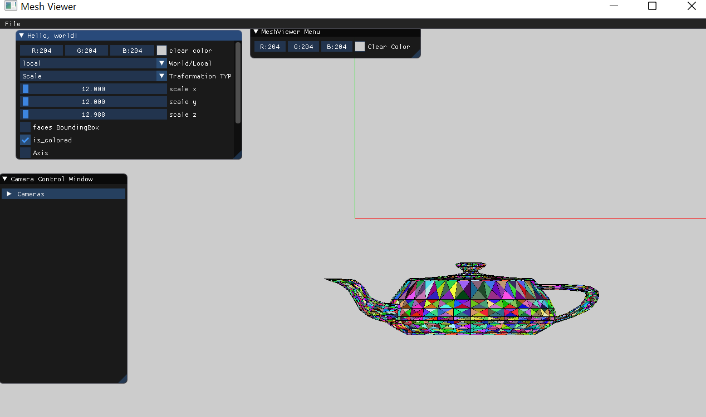

# Assignement 2_part a
 Student1 : Wajeeh Atrash - 322773946	
 
Student2 :Mohammed Seh - 209332212
___
## 1.Drawing the bounding rectangle for each triangle in a different color.

___
## 2.creating a 2D bolean array for each face bounding triangle
we did some thing different than the 2d matrix for each face we iterate over the coordinates in the bounding rectangle and check if it inside the face line if our claculation returned true then we changes the pixel color
we checks if the pixel inside the triangle by calculating cross product of each two vectros and check if they pointing to he same direction if yes then the point inside the triangle else it's outside the triangle 

___

## 3.Changing the DrawTriangle function such that fills the entire triangle.

___
## 4.Implement the z-buffer algorithm
loading the bunny and the demo models and make bunny infront of the demo model

with out Z_buffer
