# Assignement 2_part b
 Student1 : Wajeeh Atrash - 322773946	
 
Student2 :Mohammed Seh - 209332212
___
## 1.Ambient Light.
we used the formula that we saw at the lecture to calculate the ambient light(Ia=Ka*La)
Ka=(0.58,0.91,0.95)
La=(0.95,0.36,0.87)
we did the calculation and got this color
Ia=(0.551,0.3276,0.8265)
because the ambient color isn't related to the light location the color didn't change when we changed its position
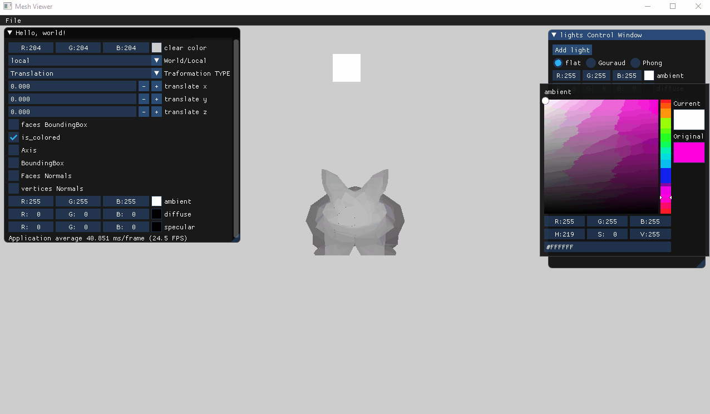
___
## 2.FlatShading (Diffuse).
we calculated the difuuse light according to the formula we saw at the lecture 
Id=Kd*(l.dot(n))*Ld
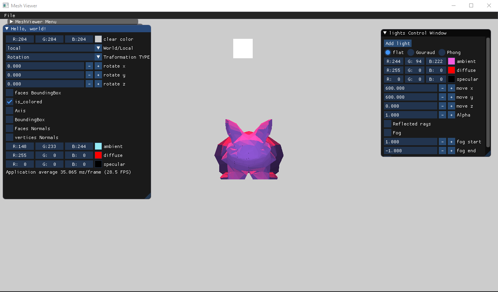
___
## 3.Gouraud Shading
we calculated the color of each vertex for each face then for each pixel inside the face we did a color iterpolation to calculate its color
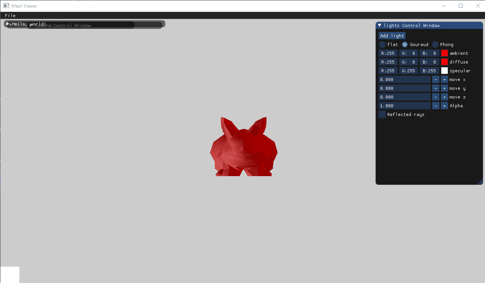
___
## 4.Reflected Rays.
for each face we calculated the reflected using this formula
 r = 2*n * glm::dot(n, l) - l
 and draw it (yellow lines)
 for light ray we used the l vector direction light (lightlocation-point) then draw it (torquise color)
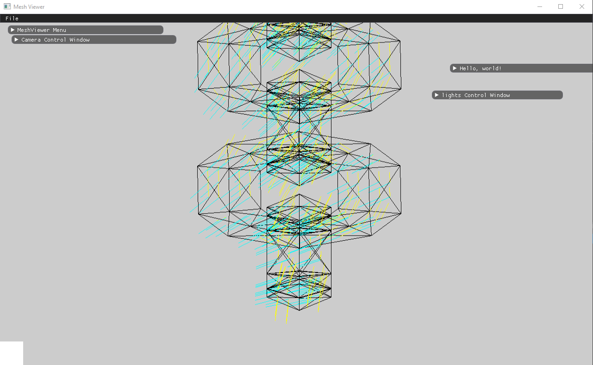
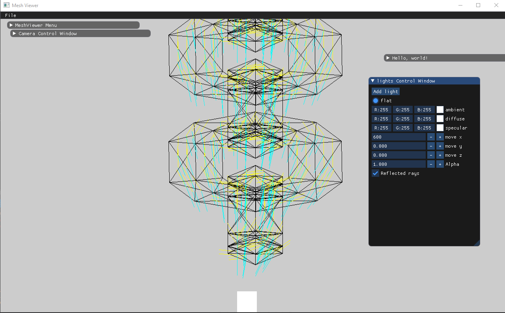
___
## 5.PhongShading with specular light
we calculated the specular light according to the formula we saw at the lecture

r = 2 * n * glm::dot(n, l) - l

v=camera eye vector

Is=Ks * glm::dot(r,v) * ls

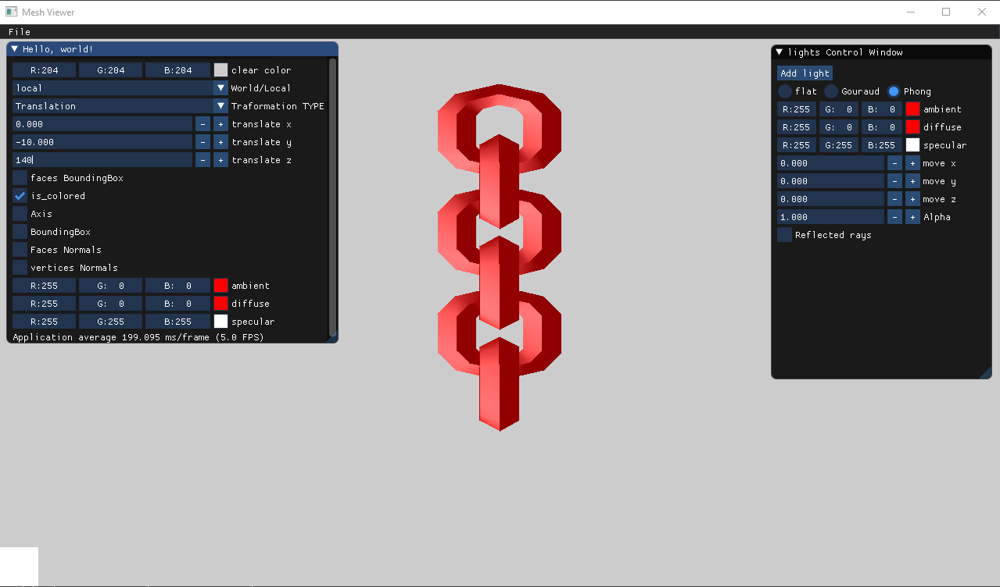
___
## 6.Directional Light
to implement directional light we should but the light at infinte x or y but if we did that the the degree that we calculate in the light elemnts will be zero and the calculation will be wrong so we but the light at a far location so it will look like its at infinte 
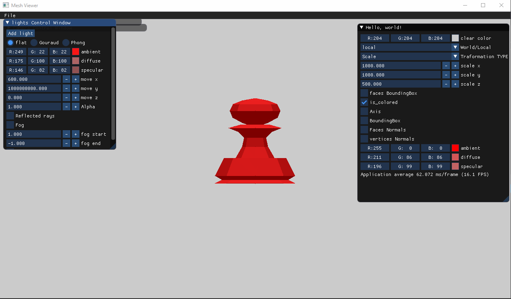
___
## 7.Different models and lights
**bunny with two lights,each light have different colors with gouraud shading**
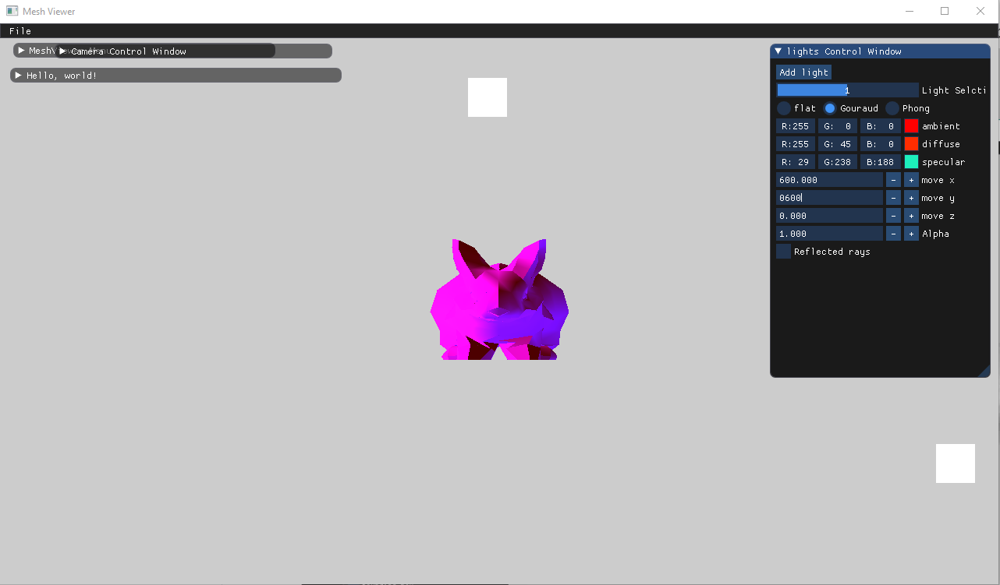
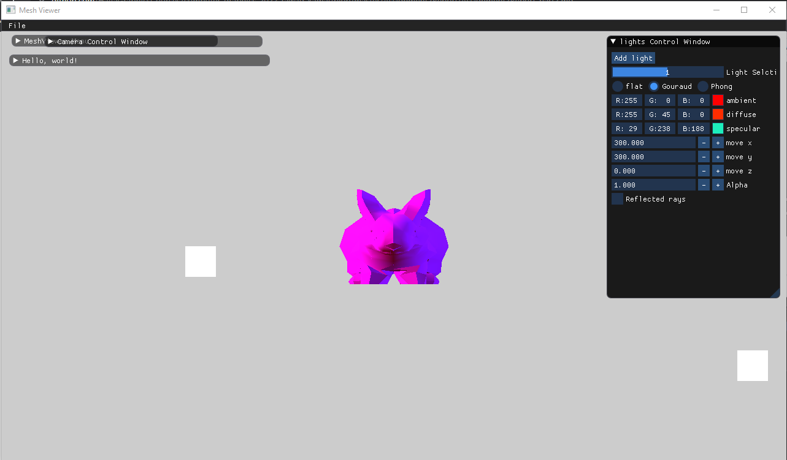
**Phong shading with one light,in each picture the light exist in a different location**
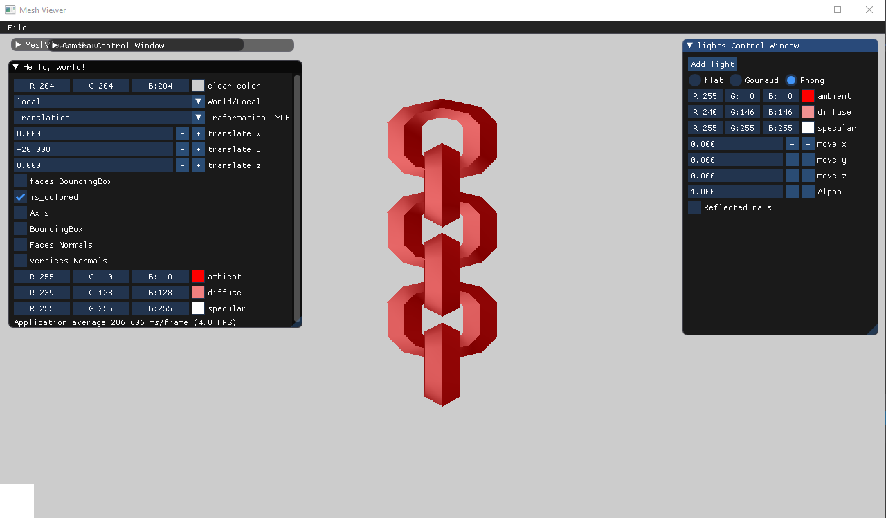

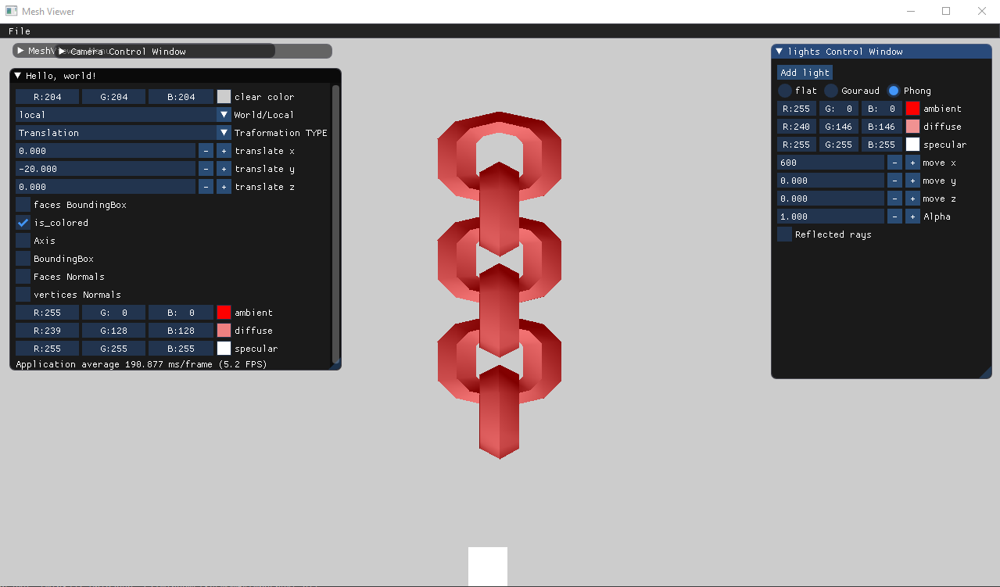

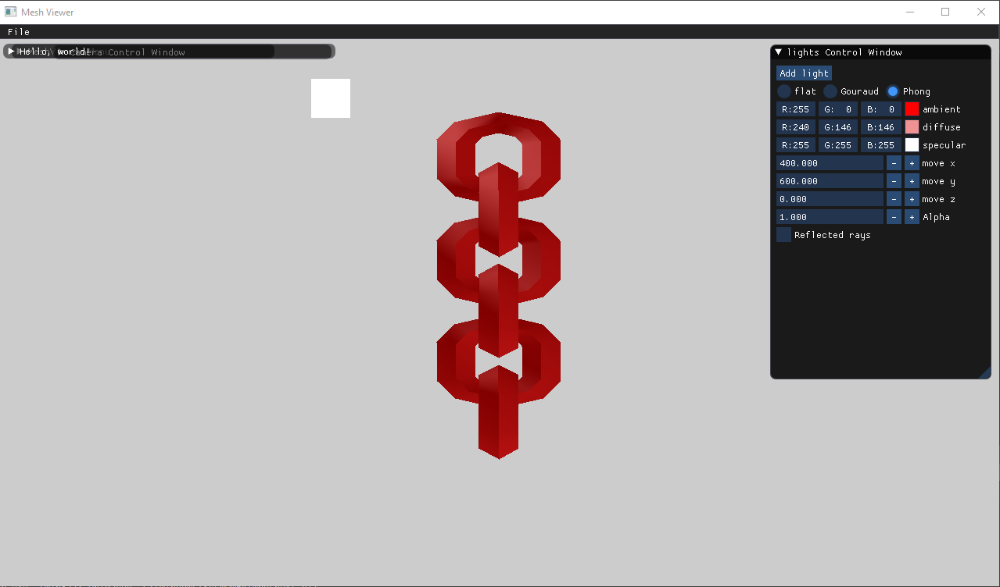

**phong shading with two lights**
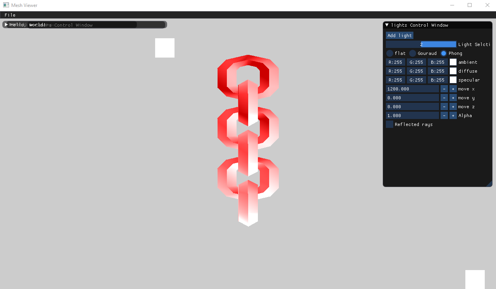
**Gouraud shading for bannana meshmodel**
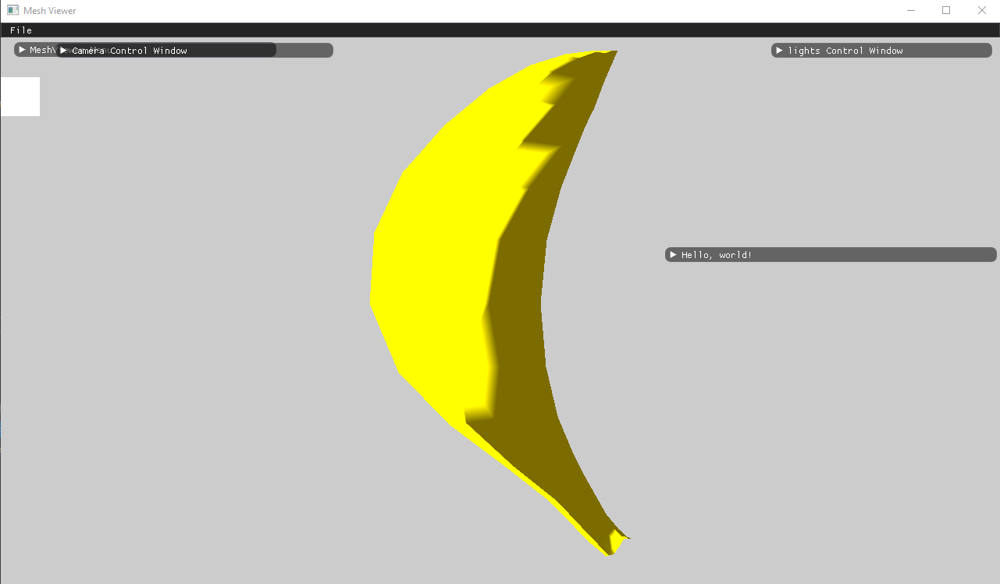
___
## 8.Post Processing Effects
a- we implemented fog effect
**the pawn with the fog effect**
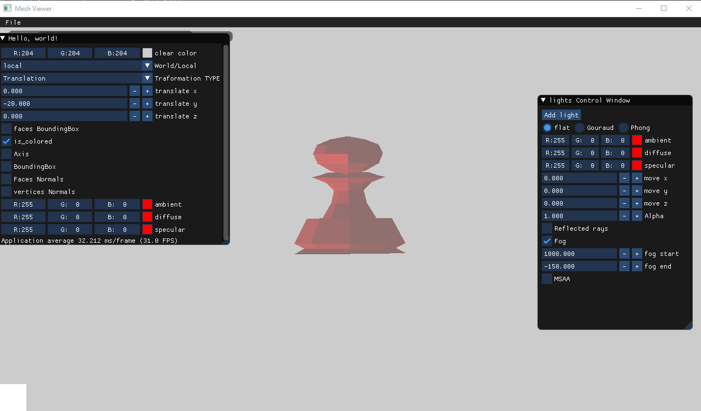
**bunny and chain  with the fog effect**
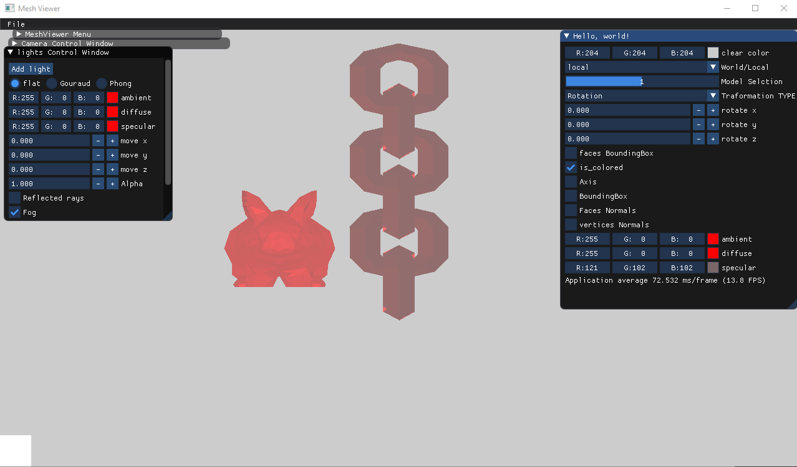
a- we implemented Box Blur:in this section we used convultion with 5x5 filter
which each pixel in the resulting image has a value equal to the average value of its neighboring pixels.

**The banana before bluring effect**
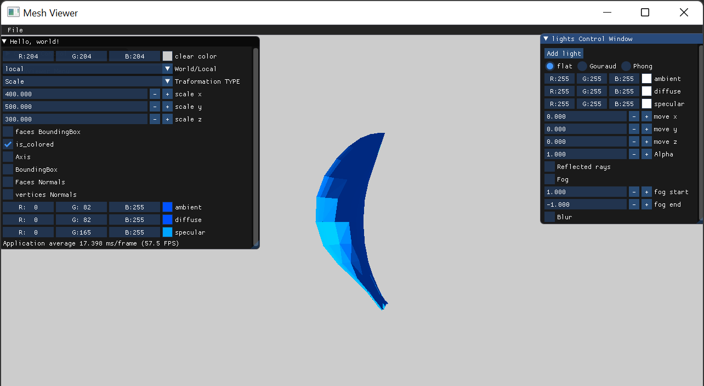
**The banana after bluring effect**
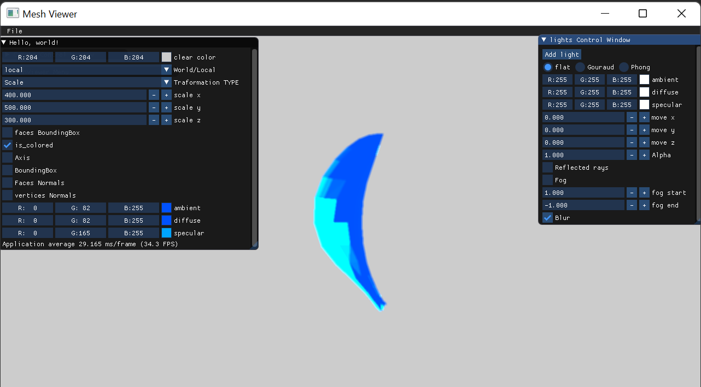
**The bunny after bluring effect**

