# Assignement 3
 Student1 : Wajeeh Atrash - 322773946	
 
Student2 :Mohammed Seh - 209332212
___
## 1.InitOpenGLRendering()
At first function glGenTextures we creates one texture name the returned using the GLuint pointer gl_screen_tex, then we generate one VAO that we got a pointer to it gl_screen_vtc then we bind it and create a buffer, then we initialize two arrays (vtc,tex) vtc: coordinate arrays for the vertices , tex: coordinates for the texture mapping, after that we bind the buffer to our target(GL_ARRAY_BUFFER) by this step we allocated memory for our data and we  will be able to pass it, then we initiate the fragment and vertex shader and make them active by telling OpenGL to use them after that we telling OpenGl where to find the vertex coordinates and the texture coordinates and pass them to the shaders and draw them on the screen.
___
## 2.Updating the MeshModel Class
we added the vbo and vao to the MeshModel attributes at thee time of cunstructing the MeshModel object we generated the vao so its can point to the vbo then binded it and figure it so OpenGL can know how to dind it then we creates a buffer and we giving it the refrence for vbo then we bind the the vbo and later we stored the vertices to it(vbo).
and at the renderer class we used glDrawArrays to draw triangles.
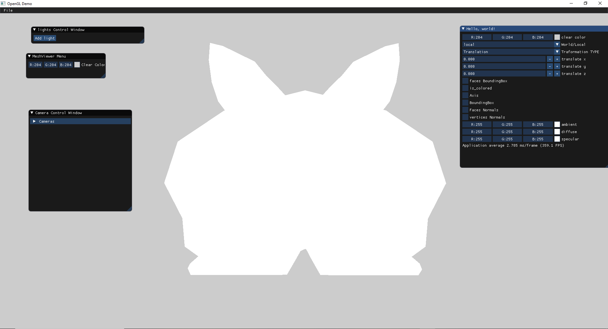
___
## 3.Vertex Shader
**Vertex Shader code:**

- model- stands for the (world Transformation)*(Model Transformation).
- view - lookat vector for the active camera.
- projection- the projection matrix (ortho/pers).
-

    #version 330 core

    layout(location = 0) in vec3 pos;
    layout(location = 1) in vec3 normal;
    layout(location = 2) in vec2 texCoords;

    // The model/view/projection matrices
    uniform mat4 model;
    uniform mat4 view;
    uniform mat4 projection;

    // These outputs will be available in the fragment shader as inputs
    out vec3 color;

    void main()
    {
        gl_Position = projection * view *  model * vec4(pos, 1.0f);
    }
**GIF**

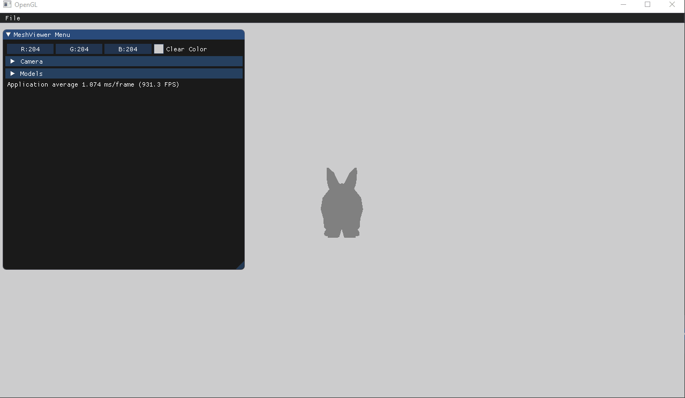

---
## 4.fragment shader
    #version 330 core

    out vec4 frag_color;

    void main()
    {
        frag_color = vec4(0.5,0.5,0.5,1);
    }
**picture for a model**
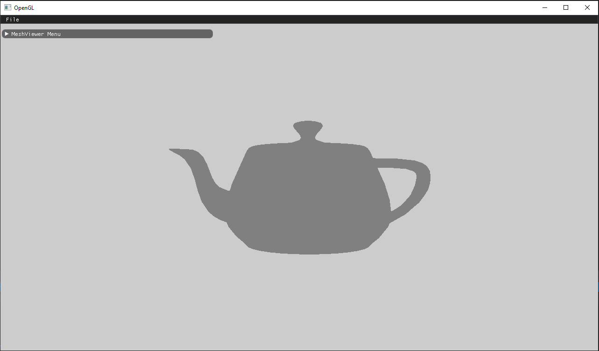

---
## 5.Render Code
    void Renderer::Render(const std::shared_ptr<Scene>& scene)
    {
        // TODO: Replace this code with real scene rendering code
        int half_width = viewport_width / 2;
        int half_height = viewport_height / 2;
        int camera_count = scene->GetCameraCount();
        if (camera_count > 0)
        {
            int model_count = scene->GetModelCount();
            if (model_count > 0)
            {
                const Camera& active_camera = scene->GetActiveCamera();
                for (int model_index = 0; model_index < model_count; model_index++)
                {
                    std::shared_ptr<MeshModel> currentModel = scene->GetModel(model_index);
                    // Activate the 'colorShader' program (vertex and fragment shaders)
                    colorShader.use();
                    // Set the uniform variables
                    colorShader.setUniform("model", currentModel->GetWorldTransformation()*currentModel->GetModelTransformation());
                    colorShader.setUniform("view", active_camera.GetViewTransformation());
                    colorShader.setUniform("projection", active_camera.GetProjectionTransformation());
                    //drawing the model
                    glPolygonMode(GL_FRONT_AND_BACK, GL_FILL);
                    glBindVertexArray(currentModel->GetVAO());
                    glDrawArrays(GL_TRIANGLES, 0, currentModel->GetModelVertices().size());
                    glBindVertexArray(0);
                    //------------------
                    glPolygonMode(GL_FRONT_AND_BACK, GL_LINE);
                    glBindVertexArray(currentModel->GetVAO());
                    glDrawArrays(GL_TRIANGLES, 0, currentModel->GetModelVertices().size());
                    glBindVertexArray(0);
                }
            }
        }
    }
---
## 6.Phong Shading ##
**teapot**

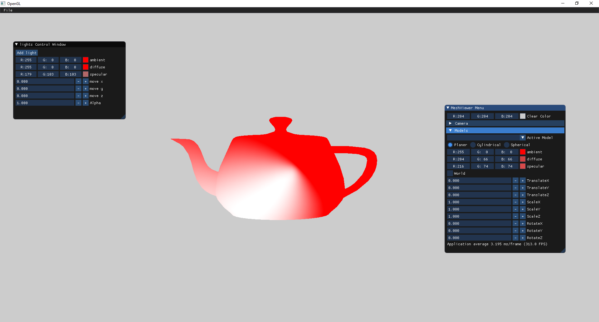

**Sphere**

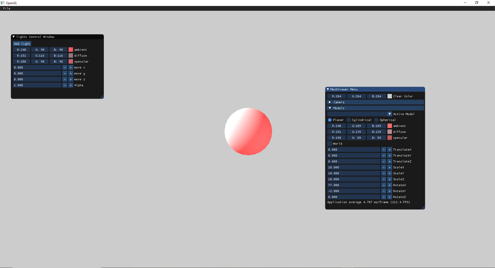

**Armadelo**

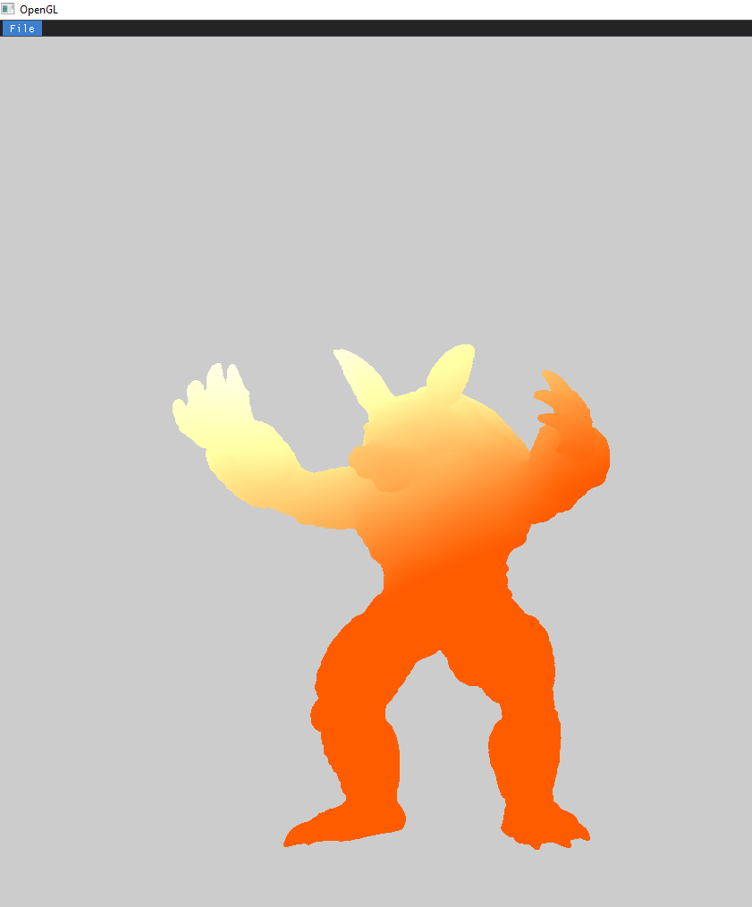

**Armadelo Gif**

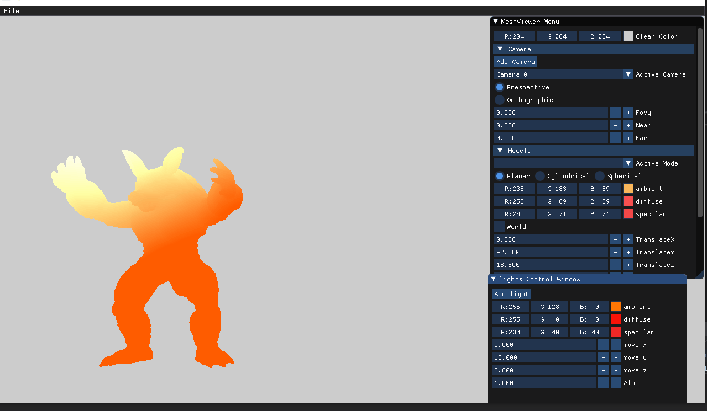

---

## 7.Texture mapping

**Planer**

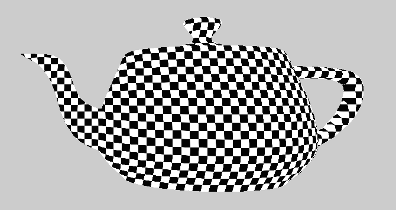

**Cylindrical**

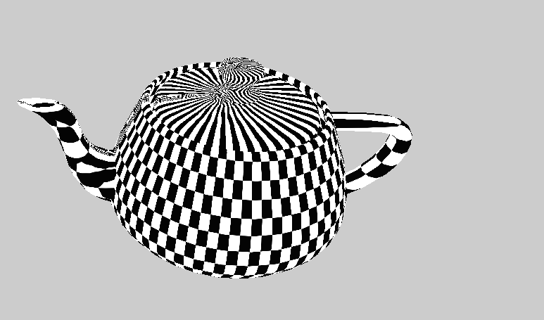

**Spherical**

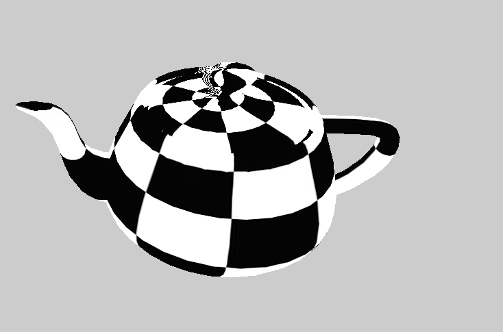

**model with texture**
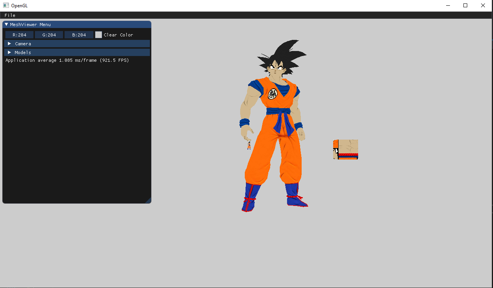
---
## 8.ToonShading,NormalMapping,EnvironmentMapping

**Toon Shading**

we defined a constant number of brightness levels after calculating the brightness for a coordinate we calculate the level which it belong to then floor the brightness value to the appropriate value.
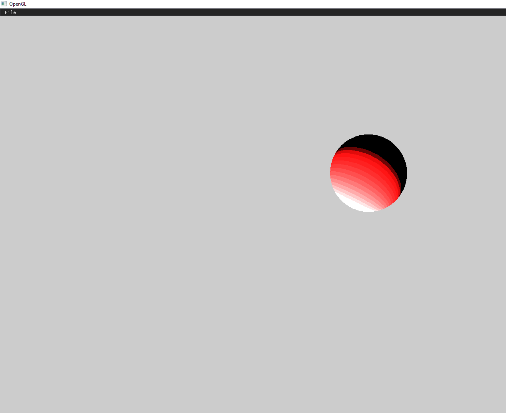

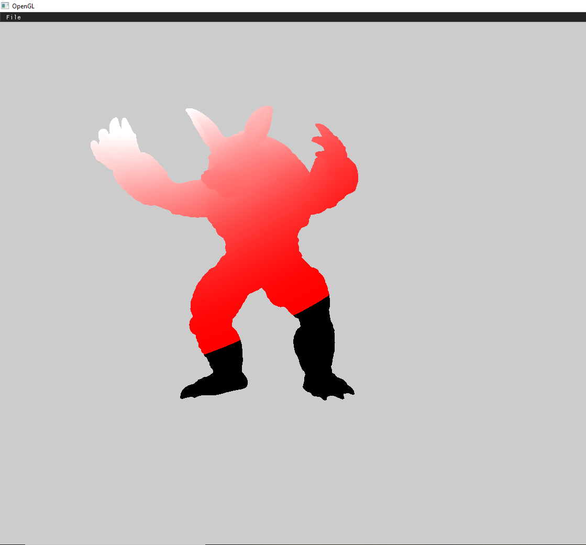

---

**Environment Mapping**

we implemented a cube texture mapping to add a skybox as the envronment for the model, then inside the vertex shader we calculated the reflected color from each vertex using the reflect and pass it to the fragment shader inside the fragment shader we defined a samplercube uniform and calculated the texture coordinate acoording to it (from the skybox) then calculated the light and did a mix between the two colors.

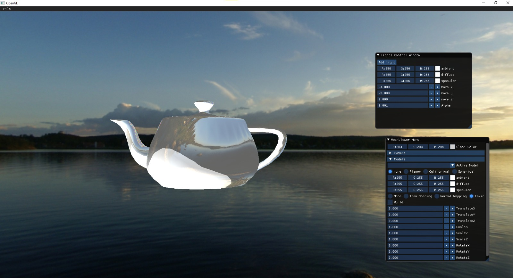

---
we used the phong shading formula that we learned and swapped the material color in the eqwuation with the model texture color and we used a different normal from the coordinates normal in our calculations.
the normal that we used: 

normal = vec3(texture(material.textureMap, frag_tex_coords)).rgb

normal = normalize(normal * 2.0 - 1.0)   

**Before Normal Mapping**

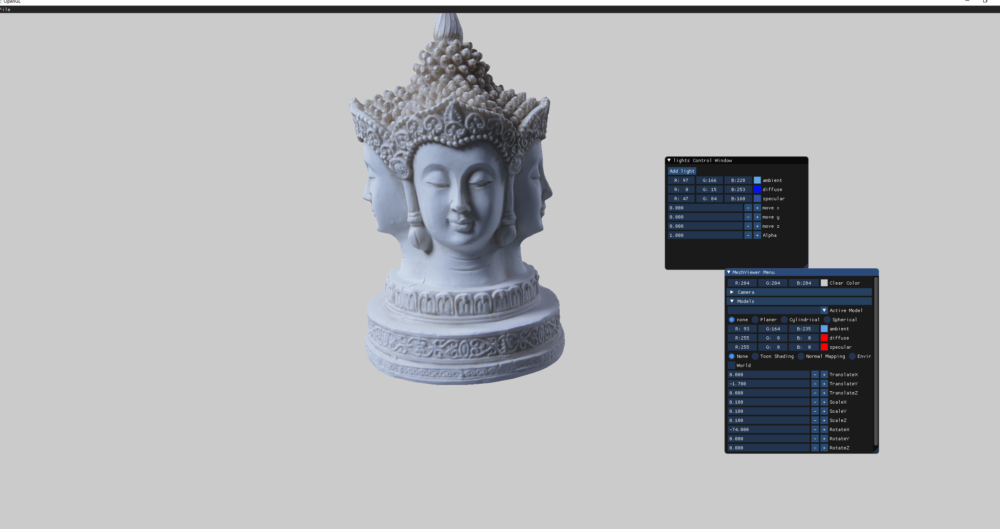

**After Normal Mapping**

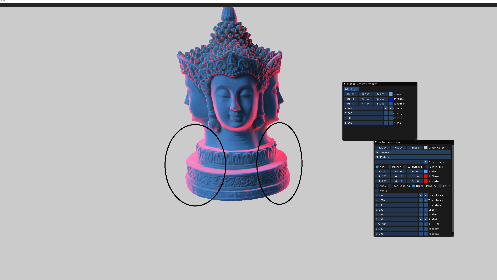

